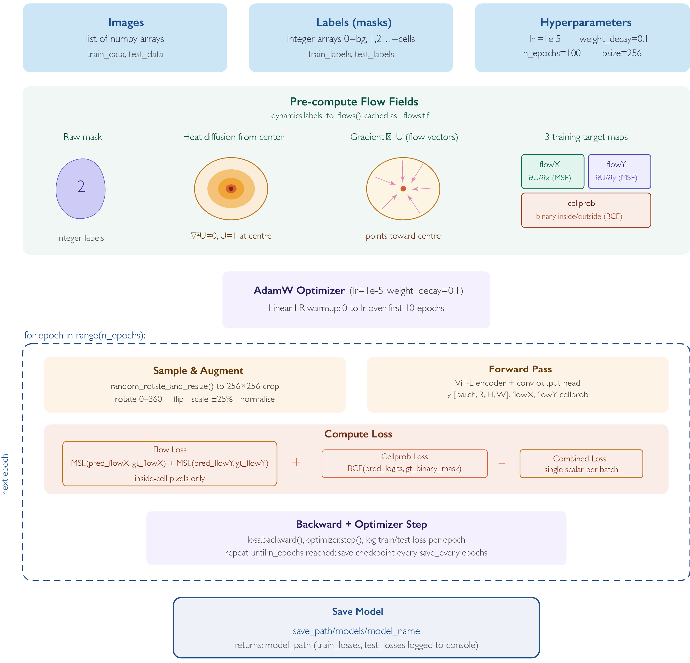

# Final Project for BMEG 591T!

Fine-tuning Cellpose-SAM for segmentation of individual fluorescent bacteria in Airyscan confocal images of mouse colon tissue sections.

## Description of dataset 

Germ-free mice monocolonised with a genetically engineered *E. coli* Nissle 1917 strain carrying a constitutive BFP reporter and two stress-inducible reporters (GFP, RFP). Tissue sections were imaged by Zeiss Airyscan confocal (100×, 5×5 tile scans, 16-bit, ~6300×6300 px per image).

| Channel | Fluorophore | Purpose |
|---------|-------------|---------|
| C1 | BFP (constitutive) | Segmentation input + ratio denominator |
| C2 | GFP (osmotic-stress promoter) | Reporter — OFF in low osmolality |
| C3 | RFP (oxidative-stress promoter) | Reporter — measured as RFP/BFP |
| C4 | SYTOX far-red | Host nuclear stain — exclusion mask |

Pixel size: **0.035 µm/px**. Raw files are `(4, H, W)` uint16 TIFFs exported from Zeiss Zen.

## Approach

Iterative "human-in-the-loop" fine-tuning of Cellpose-SAM on manually corrected masks from my bacteria in non-cleared colon tissue with a relatively high level of fecal autofluorescence. 

Applies the train.train_seg() custom function by Pachitariu and Rariden (cellpose-SAM authors). I've illustrated the function here:


## Current results

| Model | Internal val AP@0.5 | External val AP@0.5 (Scene-02) |
|-------|---------------------|-------------------------------|
| Base Cellpose-SAM | 0.641 | 0.624 |
| 5stacks (round 1) | 0.842 | 0.658 |
| 4stacks_5x5_norm (round 2) | **0.724** | **0.720** |

Round 2 (`4stacks_5x5_norm`): 4 training stacks, 5×5 patches (~1265×1265 px), global BFP normalisation, multi-channel annotation review. 75 training patches, 3,913 annotated cells.

## Environments

Two conda environments included, once for macOS, and one for microsoft (NVIDIA CUDA)

**macOS (Apple Silicon):** MPS backend, Cellpose 4.1.1, PyTorch 2.11.0, Python 3.10.20  
**Windows (NVIDIA):** CUDA 12.4 build — use `environment_windows.yml` instead

Omnipose needs a separate env:

```bash
conda create -n omnipose python=3.10
pip install omnipose tifffile imagecodecs matplotlib numpy
```

## Pipeline overview

```bash
python scripts/make_splits.py                      # generate data/splits.json (70/15/15)
python scripts/inference_norm.py --split all       # after this step, make "ground truth" masks on patches
python scripts/finetune.py --run-name <name_of_model>      
python scripts/pipeline.py --split all             # meausrement pipeline for downstream analysis (not part of training project!)
```
